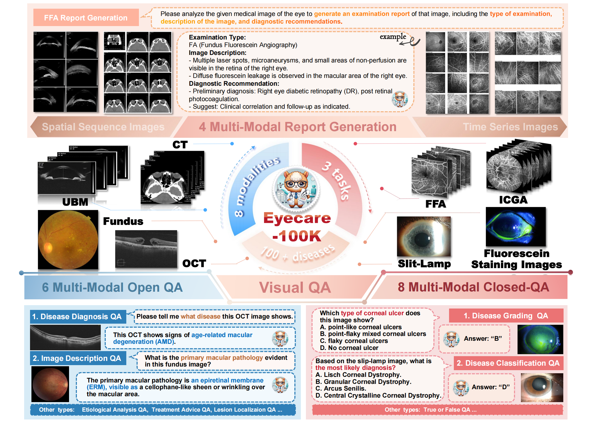
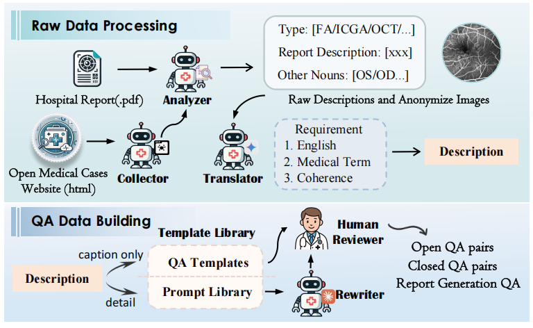
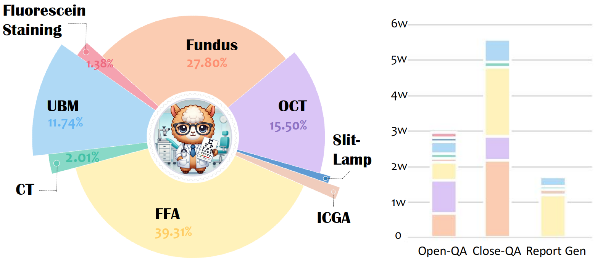
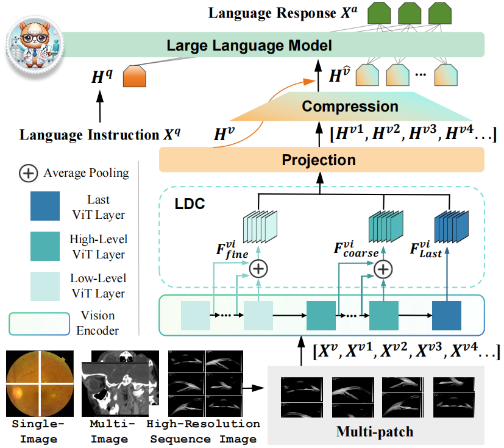

<h1 align = "center">

EyecareGPT: Boosting Comprehensive Ophthalmology
Understanding with Tailored Dataset, Benchmark and Model
</h1>

Sijing Li1, Tianwei Lin1, Lingshuai Lin2, Wenqiao Zhang1, Jiang Liu1, Xiaoda Yang1, Juncheng Li1, Yucheng He3, Song xiaohui1, Jun Xiao1, Yueting Zhuang1, Beng Chin Ooi4
  

1Zhejiang University,
2Harbin Institute of Technology,
3Chenzhou No. 1 People's Hospital,
4National University of Singapore

## 🌟 Overview

Welcome to **EyecareGPT!** 🚀
This repository showcases the **Eyecare Kit**, a comprehensive solution designed to advance the adaptability and performance of Large Vision-Language Models (LVLMs) in the specialized domain of ophthalmology. Our work aims to  facilitate research on intelligent ophthalmic diagnosis field by introducing innovations across three key aspects: **Dataset**, **Benchmark**, and **Model**.

##### :clap: Key Highlights:

- **Eyecare-100K: The First Comprehensive Ophthalmic Visual Instruction Dataset.** We present a large-scale, diverse dataset comprising approximately **102,000** visual question answering (VQA) pairs, covering **8** imaging modalities, **3** tasks， over **15** anatomical structures, and more than **100** types of eye diseases.
- **Eyecare-Bench: A Systematic Benchmark for Intelligent Ophthalmic Diagnosis.** We introduce a novel benchmark for in-depth evaluation of Med-LVLMs on closed QA, open QA, and report generation tasks, featuring around 15,000 carefully selected examples.
- **EyecareGPT: An Adapted LVLM Architecture for Ophthalmology.** We present a model incorporating high-resolution visual feature extraction, an adaptive resolution mechanism, and dense feature integration, with scalable variants for real-world deployment.

## 🔥 News

- **[2025.02.17]** We have released the pre-trained weight on HuggingFace and dataset demo of Eyecare-100K.

### TODO

- [x] Release  pre-trained weight of the model.
- [x] Release the demo of  Eyecare-100K.
- [ ] Release the inference UI/UX.
- [ ] Release inference code (e.g. training scripts).

## 📚 Task Classification and Support

**Eyecare-100K** aggregates **real-world** ophthalmic data across **8** modalities, **15+** anatomical structures and **100+** eye diseases, supporting multi-modal report generation and fine-grained visual QA tasks.

## :mailbox: Data collection and statistics

We develop an automated **multi-agent data engine** to create Eyecare-100K, converting categorized labels and raw reports into 3 kinds of structured VQA pairs: closed-QA, open-QA, report generation.

## :ferris_wheel: Architecture

**EyecareGPT**: We introduce an LVLM architecture adapted to complex, heterogeneous ophthalmic clinical imaging, achieving SoTA performance. **(i) High-Resolution Feature Extraction:** Employ SigLIP to enhance local lesion perception.  **(ii) Adaptive Resolution Mechanism:** Accommodate variable resolutions in clinical ophthalmic imaging. **(iii) Layer-wise Dense Connector (LDC):** Densely integrate multi-scale visual features and preserve fine-grained structural information.

## 🛠️ Getting Started

**EyecareGPT**  is our ophthalmology-specialized LVLM, built on **Eyecare-100K**. We have released our model in two configurations, **EyecareGPT-3.8B** and **EyecareGPT-7B**, to suit different requirements and resource availability:

- EyecareGPT-3.8B: A smaller version optimized for speed and reduced memory usage.
- EyecareGPT-7B: A larger version designed for higher Performance.

**Model Access：**

|      Model      |                         Download                         |
| :-------------: | :------------------------------------------------------: |
| EyecareGPT-3.8B | [HF Link](https://huggingface.co/LLSuzy/EyecareGPT-3.8B) |
|  EyecareGPT-7B  |  [HF Link](https://huggingface.co/LLSuzy/EyecareGPT-7B)  |

EyecareGPT utilizes `siglip-so400m-patch14-384` as the visual encoder and employs `Phi-3.5-mini-instruct` and `Qwen2.5-VL-7B-Instruct` as the pre-trained LLM base models for EyecareGPT-3.8B and EyecareGPT-7B, respectively. Please download the corresponding weights:

|          Model Type          |         Model Name          |                           Download                           |
| :--------------------------: | :-------------------------: | :----------------------------------------------------------: |
|             ViT              | `siglip-so400m-patch14-384` | [Download](https://huggingface.co/google/siglip-so400m-patch14-384) |
| Base Model (EyecareGPT-3.8B) |   `Phi-3.5-mini-instruct`   | [Download](https://huggingface.co/microsoft/Phi-3.5-mini-instruct) |
|  Base Model (EyecareGPT-7B)  |  `Qwen2.5-VL-7B-Instruct`   | [Download](https://huggingface.co/Qwen/Qwen2.5-VL-7B-Instruct) |

 Training and testing scripts code is coming soon...

